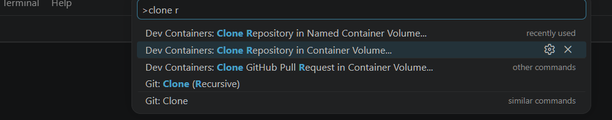
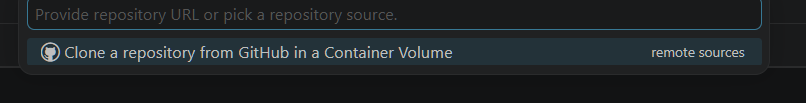
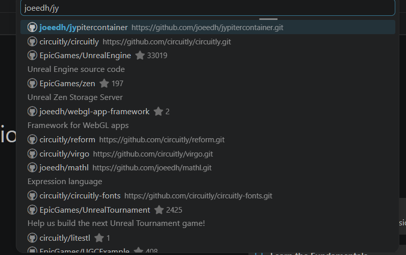

To start devcontainer:

## In VSCode

Run command "clone repository in volume" (this is important to prevent slow IO accessing windows NTFS).  Press `ctrl-p` to bring up the command search menu:



Click on github:




Click on the 'master' branch


## Command line

Ensure you have nodejs and npm installed, for debian linux this is
```
sudo apt install npm nodejs -y
```

Install devcontainer cli, e.g.

```
sudo npm install --global @devcontainers/cli
```

## Starting the container

```
devcontainer up
```

The dev container will automatically start a jypiter lab server.  If it doesn't
you can start one by running ```./start-jypiter.sh```

Open [http://localhost:8888](http://localhost:8888)
